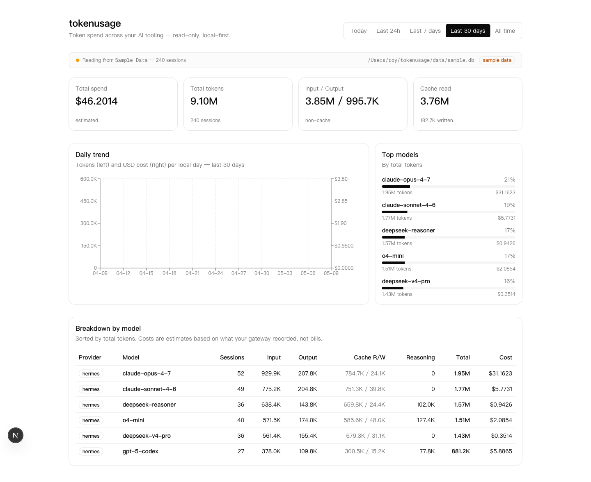

# tokenusage

A local-first dashboard that shows how many tokens — and how many dollars — you've spent across multiple AI coding tools (Claude Code, Codex, DeepSeek, ...). Reads usage data straight from your local gateway / CLI logs. No backend, no telemetry, no account.



> Status: **v0.4**. Ships adapters for Hermes, Codex CLI, and Claude Code. Per-session detail pages, CSV export, and a user-editable price table. Screenshot above is from the bundled synthetic sample data.

## Features

- **Total spend, total tokens, input/output/cache breakdown** at a glance
- **Daily trend chart** (tokens + USD) over the selected window
- **Per-model breakdown table** with cost estimates
- **Period selector**: Today / 24h / 7d / 30d / All
- **Read-only** — your data never leaves the machine
- **Fallback sample data** so the dashboard renders even before you connect a real source

## Quickstart

```bash
pnpm install
pnpm sample        # generate data/sample.db (already committed; only needed if you customize)
pnpm dev
```

Open <http://localhost:3000>.

The dashboard auto-detects every supported source on the machine and merges them:

| Source | Path | Env override |
|---|---|---|
| Hermes gateway | `~/.hermes/state.db` | `TOKENUSAGE_HERMES_DB` |
| Codex CLI | `~/.codex/state_5.sqlite` + `~/.codex/sessions/**.jsonl` | `TOKENUSAGE_CODEX_DIR` |

If none are present it falls back to the bundled synthetic sample database, so the dashboard always renders something.

## Architecture

```
src/
├── app/
│   ├── page.tsx          # Server-rendered overview (queries DB directly, no API routes)
│   └── layout.tsx
├── components/
│   ├── period-tabs.tsx   # URL-driven period selector
│   ├── usage-trend.tsx   # Recharts line chart (client component)
│   └── ui/               # shadcn/ui primitives
└── lib/
    ├── adapters/
    │   ├── hermes.ts     # better-sqlite3 readonly → ~/.hermes/state.db
    │   ├── codex.ts      # state_5.sqlite + last token_count event from each rollout JSONL
    │   ├── claude-code.ts # walks ~/.claude/projects/**.jsonl
    │   ├── sample.ts     # reads data/sample.db
    │   └── index.ts      # merges UsageRecords from every adapter that has data
    ├── pricing.ts        # loads data/prices.json (override) or data/prices.default.json
    ├── aggregate.ts      # period filtering + group-by-model + daily rollup
    ├── format.ts         # tokens / USD / int formatters
    └── types.ts          # UsageRecord, ProviderAdapter, Aggregation
```

Adding a new adapter is a matter of implementing `ProviderAdapter` from `lib/types.ts` and registering it in `lib/adapters/index.ts`.

## Costs are estimates, not bills

Cost figures come from whatever your gateway recorded at the time of the request. They're useful as a rough budget signal but should not be reconciled against an invoice. Some sessions may have no cost recorded — those are summed into a `~$X` value with a "partial cost data" hint.

## Roadmap

- [x] Codex adapter — read `~/.codex/sessions/*.jsonl` + `state_5.sqlite`
- [x] Claude Code adapter — read `~/.claude/projects/**/*.jsonl`
- [x] Per-session detail page (`/sessions/[id]`)
- [x] Export filtered view to CSV (`/api/export?period=...`)
- [x] User-editable price overrides — drop a `data/prices.json` to override `data/prices.default.json`
- [ ] Custom date range picker
- [ ] Inline price-table editor in the UI

## License

MIT
